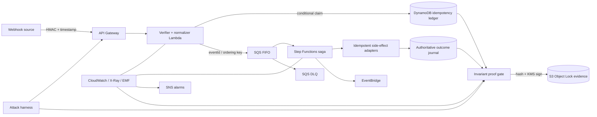
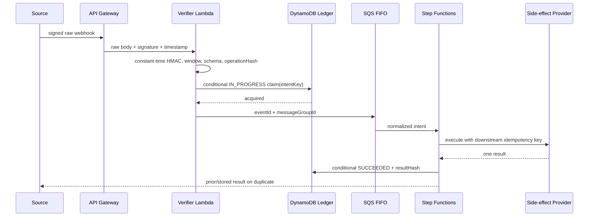
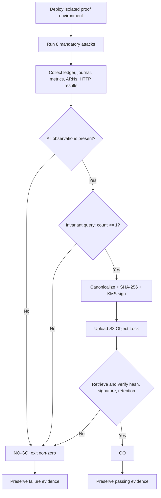
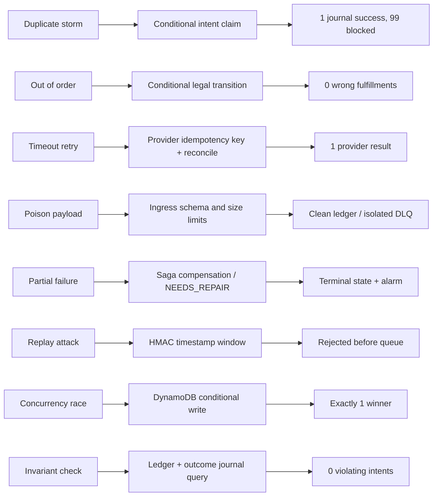

# IdemGate Architecture

IdemGate's correctness target is a business invariant, not queue delivery semantics:

> **One customer intent = exactly one successful side effect — no matter how many times the infrastructure retries, reorders, or replays.**

SQS FIFO deduplication reduces duplicate work. The DynamoDB ledger, conditional state transitions, downstream idempotency keys, and deployed attack evidence form the correctness boundary.

## High-Level Architecture

## Happy Path

## Attack And Promotion Pipeline

## Scenario, Control, Proof

## Component Responsibilities

| Component | Responsibility | Recorded proof | Pillars |
|---|---|---|---|
| API Gateway | Bounded signed-webhook ingress, throttling, size limits | HTTP result and access log | Security, Performance Efficiency |
| Verifier Lambda | Raw-body HMAC, timestamp window, normalization, operation hash | Rejection metric, trace, request ID | Security, Reliability |
| DynamoDB ledger | Atomic intent ownership and legal transitions | Item snapshot and condition/transaction result | Reliability, Security |
| SQS FIFO + DLQ | Ordered retry transport and poison isolation | receive counts, DLQ metrics | Reliability, Operational Excellence |
| Step Functions saga | Durable orchestration and compensation | execution ARN and terminal state | Reliability, Operational Excellence |
| Side-effect adapter + journal | Provider idempotency and authoritative outcome count | downstream key, result hash, journal count | Reliability |
| EventBridge | Post-commit internal fanout | matched/failed invocation metrics | Reliability, Performance Efficiency |
| CloudWatch / X-Ray / SNS | Metrics, traces, alarms, notification | datapoints and alarm state | Operational Excellence |
| KMS / Secrets Manager | Secret and evidence-signing protection | key ARN and verification result | Security |
| Attack harness | Deployed adversarial scenarios | verbatim redacted inputs and observations | Reliability, Operational Excellence |
| S3 Object Lock | Immutable evidence retention | object version, mode, retention date | Security, Sustainability |

## Well-Architected Mapping

| Pillar | IdemGate design |
|---|---|
| Operational Excellence | Automated attacks, machine gate, dashboards, runbooks, rollback, deterministic evidence |
| Security | HMAC timestamp verification, least privilege, KMS, Secrets Manager, encryption, redaction, Object Lock |
| Reliability | Conditional ledger writes, downstream idempotency, FIFO/DLQ, saga compensation, invariant query |
| Performance Efficiency | Serverless scaling, DynamoDB on-demand, asynchronous work, explicit ordering groups |
| Cost Optimization | Default USD 200/month ceiling, budgets, TTL, retention controls, on-demand services |
| Sustainability | Event-driven execution, ephemeral proof environments, TTL, right-sized retention |

## Failure Semantics

- `IN_PROGRESS` means one worker owns a bounded lease; it is not permission for another worker to repeat an ambiguous side effect.
- `SUCCEEDED` is terminal and returns the prior result for matching inputs.
- `FAILED` is safe only when no successful side effect remains.
- `NEEDS_REPAIR` stops automation when reconciliation or compensation requires a human.
- A reused `intentKey` with a different `operationHash` is a tampering/conflict error.
- Any missing proof field or unverifiable outcome count makes promotion `NO-GO`.

