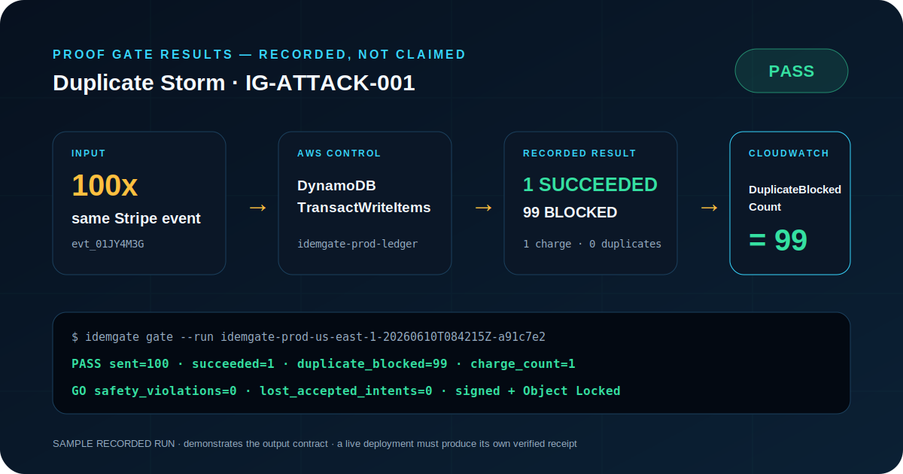

# IdemGate

<p align="center">
  
</p>


**Exactly-Once Business Outcomes for Money & Webhook Workflows on AWS**

> Retries don't guarantee correct outcomes. IdemGate proves they do.

IdemGate is a production-grade master prompt that turns an AI coding agent into a Principal AWS Reliability & Distributed-Systems Engineer. It builds an idempotent AWS workflow, attacks the deployed system, records the observations, and blocks promotion unless the business invariant passes.

**This is not another event-driven pipeline prompt. It is a business-invariant proof gate.**

## The 10-Second Proof

```text
100x identical Stripe checkout.session.completed
  → DynamoDB TransactWriteItems on idemgate-prod-ledger
  → 1 SUCCEEDED + 99 DUPLICATE_BLOCKED
  → CloudWatch IdemGate/ProofGate DuplicateBlockedCount = 99
  → authoritative outcome journal = 1 charge, 0 duplicate charges
  → signed evidence bundle + S3 Object Lock
  → GO
```

Other prompts build event pipelines. **IdemGate proves the business outcome did not happen twice.**



## The Invariant

> **One customer intent = exactly one successful side effect — no matter how many times the infrastructure retries, reorders, or replays.**

One checkout creates one charge. One payment success fulfills one order. One webhook creates one ledgered transition.

IdemGate proves both sides: **safety** means no intent produced more than one success; **liveness** means every valid accepted intent in the success terminal state produced exactly one success, with zero lost accepted-success intents.

## Why It Matters

Queues, retries, Lambda, Step Functions, EventBridge, and DLQs improve delivery reliability, but they do not prove business correctness. Duplicate delivery, timeout ambiguity, concurrent workers, illegal ordering, and partial failures can still charge or fulfill twice. IdemGate makes the business outcome observable and promotion conditional on recorded evidence.

## How It Works

| Phase | Deliverable | Gate |
|---|---|---|
| 0. Discovery | Intent key, operation hash, state machine, cost and risk contract | Ambiguity resolved |
| 1. Architecture | AWS design and Well-Architected mapping | Correctness boundaries explicit |
| 2. IaC | Parameterized, secure, tagged deployment | Clean plan and cost ceiling |
| 3. Implementation | Conditional ledger, FIFO, idempotent saga | No unsafe side-effect path |
| 4. Attack | Eight attacks against deployed infrastructure | Every observation recorded |
| 5. Evidence | Deterministic JSON/Markdown, hash, KMS signature, Object Lock | Bundle verified after upload |
| 6. Promotion | Machine-enforced invariant query | All PASS = GO; anything else = NO-GO |
| 7. Operations | Alarms, dashboards, runbooks, rollback, cleanup | Evidence retained |

See [ARCHITECTURE.md](ARCHITECTURE.md) for system and proof-pipeline diagrams.

## Attack Battery

| Attack | Expected proof |
|---|---|
| Duplicate storm, same event 100x | 1 side effect, 99 duplicates blocked |
| Out-of-order event | 0 wrong fulfillments |
| Timeout after downstream call | Retry reconciles; no second side effect |
| Poison payload | Rejected/isolated; ledger clean |
| Partial failure | Compensation or `NEEDS_REPAIR` recorded |
| Old signed replay | Rejected before queueing |
| Concurrent duplicate race | Exactly one conditional-write winner |
| Ledger invariant query | Every intent has at most one successful side effect |

## Proof Gate Results — Recorded, Not Claimed

The included [judge-readable scoreboard](PROOF_GATE_RESULTS.md), [Markdown evidence bundle](idemgate-evidence-bundle.md), [machine bundle](idemgate-evidence-bundle.json), and [raw test receipts](artifacts/tests) demonstrate the required output contract:

| Gate | AWS control | Recorded result | Exact metric | Verdict |
|---|---|---|---|---|
| Duplicate storm: `100x` same Stripe event | DynamoDB `TransactWriteItems` | `1 SUCCEEDED`, `99 DUPLICATE_BLOCKED`, `1 charge` | `DuplicateBlockedCount=99` | PASS |
| Out-of-order payment | Step Functions legal-transition condition | `0 fulfillments` | `IllegalTransitionBlockedCount=1` | PASS |
| Timeout retry: `2x` receive | Provider idempotency reconciliation | `1 prior charge`, `0 new charges` | `TimeoutReconciledCount=1` | PASS |
| Poison payload | API Gateway + verifier schema gate | `0 ledger writes`, `0 side effects` | `PoisonPayloadRejectedCount=1` | PASS |
| Replay: `48h` old signed webhook | HMAC `300s` timestamp gate | `0 queue messages`, `0 ledger writes` | `ReplayRejectedCount=1` | PASS |
| Partial failure | Step Functions compensation state | `1 refund`, `0 silently completed orders` | `SagaCompensationCount=1` | PASS |
| Concurrency race: `50` workers | DynamoDB conditional claim | `1 winner`, `49 blocked`, `1 charge` | `DuplicateBlockedCount=49` | PASS |
| Ledger invariant | Ledger + outcome-journal query | safety: `max=1`; liveness: `lost=0`; unexpected terminal successes: `0` | `InvariantViolationCount=0` | PASS |

The bundle is explicitly marked `SAMPLE_NOT_DEPLOYMENT_PROOF`. A real run is proof only after the deployed attack harness uploads, retrieves, and verifies its own KMS-signed, Object-Locked evidence.

## Quick Start

1. Open [MASTER_PROMPT.md](MASTER_PROMPT.md).
2. Copy the fenced prompt into Kiro, Claude Code, Amazon Q Developer, or another terminal-capable coding agent.
3. Answer Phase 0's blast-radius, cost, retention, and data-exposure questions.
4. Let the agent deploy, attack, collect evidence, and enforce the promotion gate.
5. Accept `GO` only when the final deployed-run bundle verifies.

## Prerequisites

- AWS account and a region with API Gateway, Lambda, DynamoDB, SQS, Step Functions, EventBridge, CloudWatch, X-Ray, KMS, Secrets Manager, S3 Object Lock, SNS, and CodeBuild
- AWS CLI credentials permitted to create the agreed resources; use a sandbox account first
- Terraform 1.7+ by default, or AWS CDK when explicitly selected
- A terminal-capable coding agent and Git
- A safe downstream sandbox or authoritative mock outcome journal
- Approval for Object Lock retention and the default USD 200/month hard ceiling

## AWS Services

API Gateway, Lambda with Powertools Idempotency behavior, DynamoDB, SQS FIFO and DLQ, Step Functions, EventBridge, CloudWatch, X-Ray, KMS, Secrets Manager, S3 Object Lock, SNS, and CodeBuild.

## Well-Architected

| Pillar | Primary controls |
|---|---|
| Operational Excellence | Automated attacks, gate, dashboards, runbooks |
| Security | HMAC window, KMS, secrets, least privilege, immutable evidence |
| Reliability | Conditional writes, provider idempotency, saga compensation |
| Performance Efficiency | Serverless scaling, async flow, ordering groups |
| Cost Optimization | Hard ceiling, budgets, TTL, on-demand resources |
| Sustainability | Event-driven execution, ephemeral test resources |

## Repository Structure

| Path | Purpose |
|---|---|
| `MASTER_PROMPT.md` | Canonical copy-paste product prompt |
| `PROOF_GATE_RESULTS.md` | Judge-readable numeric proof scoreboard |
| `idemgate-evidence-bundle.json` | Realistic, explicitly labeled sample evidence |
| `idemgate-evidence-bundle.md` | Human-readable evidence receipt |
| `artifacts/tests/*.json` | Per-gate raw sample receipts |
| `SUBMISSION.md` | AWS Prompt Library / DoraHacks submission |
| `DORAHACKS.md` | Character-checked form copy |
| `ARCHITECTURE.md` | Mermaid architecture and responsibility mapping |
| `index.html` | Self-contained landing page |
| `assets/idemgate-logo.png` | 480x480 project logo |
| `assets/proof-gate-receipt.svg` | Judge-facing visual proof receipt |

## Troubleshooting

| Symptom | Safe response |
|---|---|
| Duplicate side-effect count > 1 | `NO-GO`; disable consumer, preserve evidence, reconcile provider journal |
| Intent key reused with new payload | Reject operation-hash mismatch; do not overwrite ledger |
| Timeout leaves `IN_PROGRESS` | Reconcile downstream idempotency key before lease repair |
| Saga cannot compensate | Mark `NEEDS_REPAIR`, alarm, require audited repair |
| DLQ grows | Stop redrive until poison cause and idempotency path are verified |
| Evidence signature/retention fails | `NO-GO`; fix writer/KMS/Object Lock and rerun all attacks |

## License

[MIT](LICENSE)
